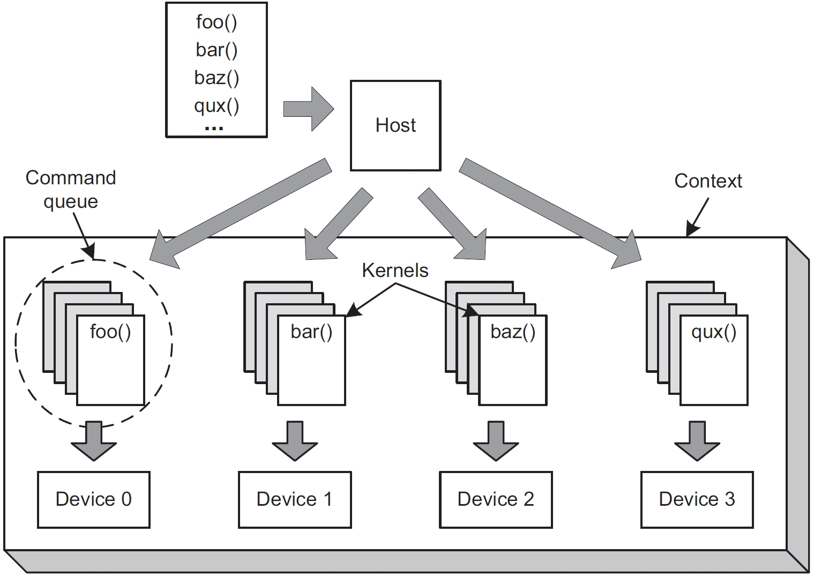
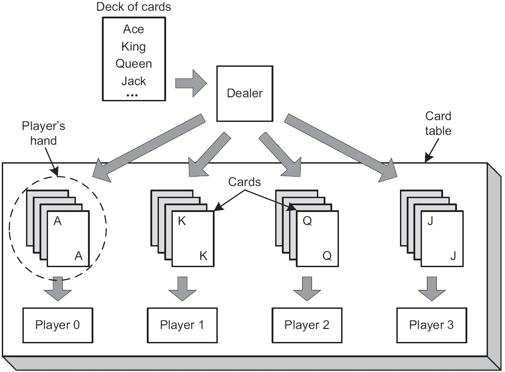
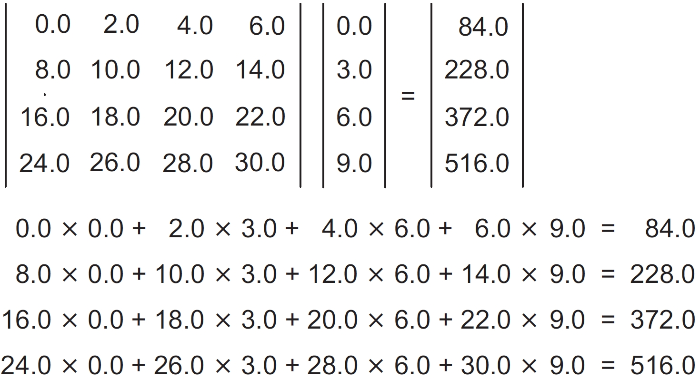

# 1. OpenCL 简介

本章内容涵盖：
- 理解 OpenCL 的目的和优势
- 介绍 OpenCL 的操作：主机(Host)和内核(Kernel)
- 通过代码实现一个 OpenCL 应用

2010 年 10 月，高性能计算领域发生了一场革命。由中国国家超级计算天津中心建造的天河-1A，从默默无闻到迅速登顶全球性能最强的超级计算机榜首。它的最大计算速度达到了2566 TFLOPS（每秒万亿次浮点运算），几乎比排名第二的 Cray 公司的 Jaguar 超级计算机快了50%。表 1.1 列出了前三名的超级计算机。

<center>
表 1.1 2010 年 Top 3 超级计算机
</center>

| 超级计算机 	| 最高速度(TFLOPs) 	| 处理器 	| 功率(kW) 	|
|:---:	|:---:	|:---:	|:---:	|
| Tianhe-1A 	| 2566 	| 14366 Intel Xeon CPU<br>7168 Nvidia Tesla GPU 	| 4040.00 	|
| Jaguar 	| 1759 	| 224256 AMD Opteron CPU 	| 6950.60 	|
| Nebulae 	| 1271 	| 9280 Intel Xeon CPU<br>4640 Nvidia Tesla GPU 	| 2580.00 	|

真正具有革命性的是天河-1A 和 Nebulae 中都配备了GPU（图形处理单元）。2009 年，前三级别的超级计算机中没有任何一台配备了GPU，甚至在前 20 名中也只有一台系统配备了GPU。正如表中所示，带有 GPU 的两套系统不仅提供了卓越的性能，还展现了惊人的能效。

使用 GPU 执行非图形任务被称为通用GPU计算，或 GPGPU 计算。2010 年之前，GPGPU 计算在高性能计算领域还被视为一种新奇事物，不值得太多关注。但如今，工程师和学者们逐渐得出结论：CPU/GPU 系统代表了超级计算的未来。

现在，一个重要的问题是：如何为这些新的混合设备编程？传统的 C 和 C++ 语言只针对传统的 CPU。同样，Cray 公司的 Chapel 语言和 Cray 汇编语言（CAL）也是如此。Nvidia的 CUDA（统一计算架构）可以用来编程 Nvidia 的GPU，但不能用于 CPU。

答案是 OpenCL（开放计算语言）。OpenCL 程序可以在 AMD、Nvidia 和 Intel 等主要制造商的 GPU 和 CPU 上执行，甚至能运行在 Sony 的 PlayStation 3 上。OpenCL 是非专有的 —— 它基于一个公开标准，所有开发工具都可以免费获取。

当你用 OpenCL 编写程序时，不用担心处理器是哪个公司设计的，也不用在意有多少个核心。你的代码可以在 AMD 最新的 Fusion 处理器、Intel 的 Core 处理器、Nvidia 的Fermi 处理器以及 IBM 的 Cell 宽带引擎上编译并运行。

本书的目的是解释如何为这些跨平台的应用程序编程，并最大限度地利用底层硬件。而本章的目标是提供 OpenCL 语言的基本概述。讨论将从 OpenCL 的优势和操作开始，然后介绍一个完整的应用程序。但是首先，了解 OpenCL 的起源非常重要。众多公司为开发这门语言投入了大量时间，一旦你明白了原因，也会理解学习 OpenCL 是值得的。

## 1.1 OpenCL 的曙光

x86 架构在个人计算领域占据了主导地位，但在图形和高性能计算领域，却没有一种普遍的架构。尽管它们有着共同的目标，但 Nvidia 的 Fermi 处理器系列、AMD 的 Evergreen 处理器系列和 IBM 的 Cell 宽带引擎之间几乎没有相似之处。每个设备都有自己的指令集，而在 OpenCL 出现之前，如果你想编程它们，就必须学习三种不同的语言。

然后，苹果公司出场了。对于那些与世隔绝的人来说，苹果公司生产了一系列极其受欢迎的消费电子产品：iPhone、iPad、iPod和 Mac 系列个人电脑。但苹果并不为 Mac 电脑制造处理器，而是选择来自其他公司的设备。如果苹果选择了某家公司生产的图形处理器用于其新设备，那么这家公司将会获得巨大的市场份额增长和开发者的关注。这就是为什么大家都对苹果那么客气。

> OpenCL 和多核计算历史上的重要事件：
> - **2001年**：IBM 发布了 POWER4，这是首款多核处理器。
> - **2005年**：首批用于桌面电脑的多核处理器发布：AMD 的Athlon 64 X2和 Intel 的Pentium D。
> - **2008年6月**：作为 Khronos Group 的一部分，OpenCL工作组成立。
> - **2008年12月**：OpenCL 工作组发布了 OpenCL 1.0 版本的规范。
> - **2009年4月**：Nvidia 发布了针对 Nvidia 显卡的 OpenCL SDK。
> - **2009年8月**：ATI（现为AMD）发布了针对 ATI 显卡的 OpenCL SDK。苹果在其 Mac OS 10.6（Snow Leopard）版本中加入了对 OpenCL 的支持。
> - **2010年6月**：OpenCL工 作组发布了 OpenCL 1.1 版本的规范。

2008 年，苹果向其供应商提出了一个问题：“为什么我们不开发一个通用接口，这样开发者就不必学习多种语言来编程你们的设备？”如果换做其他人提出这个问题，Nvidia、AMD、Intel 和 IBM 等竞争激烈的公司可能会嗤之以鼻。但没有人敢嘲笑苹果。这花费了一些时间，但最终大家集思广益，并在那年晚些时候推出了 OpenCL 的初稿。

为了管理 OpenCL 的进展和开发，苹果和其合作伙伴成立了 OpenCL 工作组。这是 Khronos Group 众多工作组之一，该联盟的目标是推动图形和图形媒体的发展。自成立以来，OpenCL 工作组发布了两个正式规范：OpenCL 1.0版本于2008年发布，OpenCL 1.1 版本于 2010 年发布，OpenCL 2.0 计划在 2012 年推出。

本节解释了为什么企业对 OpenCL 高度评价，但如果你依然犹豫不决，我也不感到惊讶。不过，下一节将深入探讨 OpenCL 的技术优势。阅读时，我希望你能更好地理解 OpenCL 与传统编程语言相比的优点。

## 1.2 为什么是 OpenCL?

你可能听说过有人将 OpenCL 称为一种独立的语言，但这并不准确。OpenCL 标准定义了一组数据类型、数据结构和函数，用于增强 C 和 C++。虽然开发者已经为 Java 和 Python 创建了 OpenCL 移植版本，但该标准只要求 OpenCL 框架提供 C 和 C++ 的库。

那么，OpenCL能做普通 C 和 C++ 做不到的呢？这个问题需要整本书来详细回答，但目前，我们可以先看看 OpenCL 的三个主要优势：**可移植性**、**标准化的向量处理**和**并行编程**。

### 1.2.1 可移植性

Java 是全球最流行的编程语言之一，其成功很大程度上归功于它的座右铭：“一次编写，到处运行。” 有了 Java，你不必为不同的操作系统重写代码，只要操作系统支持兼容的 Java 虚拟机（JVM），你的代码就能运行。

OpenCL 采用了类似的理念，更适合的口号可能是：“一次编写，运行在任何地方。” 每个提供 OpenCL 兼容硬件的厂商也提供了编译 OpenCL 代码以在其硬件上运行的工具。也就是说，你可以编写一次 OpenCL 程序，并将其编译为适用于任何兼容设备的代码，无论是多核处理器还是图形卡。这相对于普通高性能计算有很大优势，在后者中，你必须学习不同厂商的专有语言来编程他们的硬件。

这种优势不仅体现在支持任何类型的兼容硬件上。OpenCL 应用程序可以同时针对多个设备，这些设备甚至不需要具有相同的架构或来自同一厂商。只要所有设备都兼容 OpenCL，函数就能在它们上运行。这是普通 C/C++ 编程无法实现的，因为可执行文件通常只能针对一个设备。

举个具体例子，假设你有一台来自 AMD 的多核处理器，一张 Nvidia 的显卡，以及一台 IBM 的 PCI 连接加速器。通常情况下，你不可能构建一个同时针对这三个系统的应用程序，因为它们每个都需要独立的编译器和链接器。但是，一个 OpenCL 程序可以将可执行代码部署到所有这三个设备上。这意味着你可以通过一个程序统一硬件来执行一个共同的任务。如果你再连接更多兼容设备，虽然**需要重新编译程序，但不需要重写代码**。

### 1.2.2 标准化的向量处理

标准化的向量处理是 OpenCL 的一大优势，但在解释其重要性之前，我需要明确向量的含义。在本书中，向量可能以以下三种不同但基本相似的方式使用：

- **物理或几何向量**：具有大小和方向的实体，通常用于物理中表示力、速度、热传递等。在图形学中，向量用于表示方向。
- **数学向量**：有序的一维元素集合，与二维元素集合（矩阵）相区分。
- **计算向量**：包含多个相同数据类型元素的数据结构。在向量操作期间，每个元素（称为分量）在同一个时钟周期内进行操作。

最后一种用法对于 OpenCL 尤为重要，因为高性能处理器同时对多个值进行操作。如果你听说过超标量处理器或向量处理器，这就是指这种设备。几乎所有现代处理器都能够处理向量，但 ANSI C/C++ 并未定义任何基本的向量数据类型。

这看似奇怪，但问题很明显：向量指令通常是厂商特定的。Intel 处理器使用 SSE 扩展，Nvidia 设备需要 PTX 指令，IBM 设备则依赖 AltiVec 指令来处理向量。这些指令集之间没有共同点。

但通过 OpenCL，你可以编写一次向量例程，并在任何兼容的处理器上运行。当你编译应用程序时，Nvidia 的 OpenCL 编译器会生成 PTX 指令，而 IBM 的 OpenCL 编译器会生成AltiVec 指令。如果你打算让你的高性能应用在多个平台上可用，使用 OpenCL 编程将为你节省大量时间。

第 4 章讨论了 OpenCL 的向量数据类型，第 5 章介绍了用于操作向量的函数。

### 1.2.3 并行编程

如果你曾编写过大规模应用程序，可能熟悉并发的概念，即单个处理单元在进程和线程之间共享资源。OpenCL 包含了并发的方面，但它的一个主要优势是支持并行编程。并行编程将计算任务分配给多个处理单元同时执行。

在 OpenCL 中，这些任务称为**内核（kernels）**。内核是一种专门编写的函数，旨在由一个或多个 OpenCL 兼容设备执行。内核由主机应用程序发送到指定的设备或设备集。主机应用程序是运行在用户开发系统上的常规 C/C++ 应用程序，我们称其为**主机**。对于许多开发者来说，主机将内核发送到单个设备：计算机显卡上的 GPU。但内核也可以由运行主机应用程序的同一 CPU 执行。

主机应用程序使用称为**上下文（context）**的容器来管理其连接的设备。下图显示了主机如何与内核和设备交互。

为了创建内核，主机从称为**程序（program）**的内核容器中选择一个函数。然后，它将内核与参数数据关联，并将其发送到称为**命令队列（command queue）**的结构中。命令队列是主机告诉设备执行任务的机制，当内核被放入队列时，设备会执行相应的函数。

OpenCL 应用程序可以配置不同的设备执行不同的任务，并且每个任务可以操作不同的数据。换句话说，OpenCL 提供了完全的任务并行性。这是相对于许多其他并行编程工具集的重要优势，这些工具集只支持数据并行性。在数据并行系统中，每个设备接收相同的指令，但操作不同的数据集。

图 1.1 展示了 OpenCL 如何在设备之间实现任务并行性，但并未展示每个设备内部的情况。大多数 OpenCL 兼容设备由多个处理单元组成，这意味着每个设备内部还有一个额外的并行层次。第 3 章将详细解释这种并行性以及如何划分数据以充分利用设备的内部处理能力。

<center>
图 1.1 在不同 OpenCL 兼容设备上的 Kernel 分布
</center>


**可移植性**、**向量处理**和**并行编程**使得 OpenCL 比普通的 C 和 C++ 更强大，但这种更大的能力也伴随着更大的复杂性。在任何实际的 OpenCL 应用程序中，你都需要创建许多不同的数据结构并协调它们的操作。这可能很难理清，但下一节将通过一个类比帮助你获得更清晰的视角。

## 1.3 类比：OpenCL 处理和扑克游戏

当我刚开始学习 OpenCL 时，面对各种陌生的数据结构感到不知所措：平台、上下文、设备、程序、内核和命令队列。我发现很难记住它们的作用以及它们如何交互，因此我想出了一个比喻：OpenCL 应用程序的运行就像一场扑克游戏。这一开始可能听起来很奇怪，但请允许我解释一下。

在一场扑克游戏中，庄家与一位或多位玩家坐在桌前，并给每位玩家发一组牌。玩家分析自己的牌并决定下一步行动。这些玩家之间没有互动，他们只是向庄家请求额外的牌或提高赌注。庄家依次处理每个请求，一旦游戏结束，庄家就接管整个局面。

<center>
表 1.2 OpenCL 操作与扑克游戏的比较
</center>

| 扑克游戏	| OpenCL应用 |
|:---:	|:---:	|
|庄家坐在牌桌前，并确定谁是玩家。|主机选择设备并将其置于一个上下文中。|
|庄家从牌堆中挑选牌并发给每个玩家。每个玩家的牌组成一手牌。|主机从程序中选择内核，并将内核添加到每个设备的命令队列中。|
|每个玩家查看自己的手牌并决定采取什么行动。|每个设备处理通过命令队列发送的内核。|
|在游戏过程中，庄家响应玩家的请求。|主机从设备接收事件并调用事件处理程序。|
|游戏结束后，庄家查看每个玩家的手牌以确定谁是赢家。|一旦设备处理完成，主机接收并处理输出数据。|

在这个比喻中，庄家代表 OpenCL 的主机，每个玩家代表一个设备，牌桌代表一个上下文，每张牌代表一个内核。每个玩家的手牌代表命令队列。表 1.2 说明了扑克游戏的步骤如何类似于 OpenCL 应用程序的操作过程。

如果这个比喻看起来难以理解，图 1.2 描绘了一个有四位玩家的扑克游戏，每位玩家手上都有四张牌。如果你对比图 1.1 和图 1.2，希望这个比喻能变得更加清晰。

<center>
图 1.2 扑克游戏的图形表示
</center>


这个比喻将在接下来的几章中继续使用并加以扩展，它提供了一种直观理解 OpenCL 的方式，但也有一些缺陷。以下是六个最显著的缺陷：
- 这个比喻没有提到 `platforms`。平台是一个数据结构，用于标识某个供应商的 OpenCL 实现。平台提供了一种访问设备的方式。例如，你可以通过 Nvidia 平台访问 Nvidia 设备。
- 牌局中的庄家不会选择坐在桌前的玩家，而 OpenCL 的主机会选择哪些设备应被置于一个上下文中。
- 牌局中的庄家不能将同一张牌发给多个玩家，但 OpenCL 的主机可以通过命令队列将同一个内核发送到多个设备。
- 这个比喻没有提到数据或其如何在 OpenCL 设备中进行分区。OpenCL 设备通常包含多个处理单元，每个单元可能处理输入数据的一个子集。主机设置数据的维度并确定计算将被分区为多少个工作项。
- 在牌局中，庄家将牌分发给玩家，每个玩家将牌排列成一手牌。而在 OpenCL 中，主机将内核执行命令放入命令队列中，默认情况下每个设备按照主机入队的顺序执行内核。
- 在牌局中，庄家通常以轮流发牌的方式进行，而 OpenCL 不对如何将内核分配给多个设备设置任何限制。

如果你仍然对 OpenCL 的术语感到紧张，不必担心。第二章将进一步解释这些数据结构，并展示如何在代码中访问它们。毕竟，代码才是最终目标。接下来的章节将为你展示 OpenCL 代码的初步样貌。

## 1.4 OpenCL 应用初探

此时，你应该对 OpenCL 的目标有了较为清晰的认识。我希望你也对 OpenCL 应用程序的工作原理有了基本的了解。不过，如果你想深入了解 OpenCL，就必须查看源代码。

本节将展示两个 OpenCL 源文件，一个用于 Host 处理器，另一个用于设备。它们共同完成一个 4x4 矩阵和 4 元素向量的乘积运算。这种操作在图形处理领域至关重要，矩阵通常表示一种变换，向量则代表一种颜色或空间中的一个点。图 1.3 展示了矩阵与向量相乘的样子，并给出了生成结果的公式。

<center>
图 1.3 矩阵向量乘积
</center>


如果你打开包含本书示例代码的目录，你会在 Ch1 文件夹中找到这些源文件。第一个文件是 matvec.c，它在主机上执行，创建一个内核并将其发送到找到的第一个设备。下面的列表展示了该主机代码的样子。请注意，源代码是用 C 编程语言编写的。

> **注意**：错误检查例程已从此列表中省略，但你可以在本书示例代码中的 matvec.c 文件中找到它们。

<center>
代码 1.1 创建并发布一个矩阵-向量乘积核：matvec.c
</center>

```cpp
#define PROGRAM_FILE "matvec.cl"
#define KERNEL_FUNC  "matvec_mult"

#include <stdio.h>
#include <stdlib.h>
#include <sys/types.h>

#ifdef MAC
#include <OpenCL/cl.h>
#else
#include <CL/cl.h>
#endif

int main()
{
    cl_platform_id platform;
    cl_device_id device;
    cl_context context;
    cl_command_queue queue;
    cl_int i, err;

    cl_program program;
    FILE *program_handle;
    char *program_buffer, *program_log;
    size_t program_size, log_size;
    cl_kernel kernel;
    size_t work_units_per_kernel;

    float mat[16], vec[4], result[4];
    float correct[4] = {0.0f, 0.0f, 0.0f, 0.0f};
    cl_mem mat_buff, vec_buff, res_buff;

    for(i = 0; i < 16; ++i)                     //
    {                                           // 1. 初始化矩阵数据
        mat[i] = i * 2.0f;                      // 
    }

    for(i = 0; i < 4; ++i)                      //
    {                                           // 
        vec[i]   = i * 3.0f;                    //
        correct[0] += mat[i]      * vec[i];     // 1. 初始化向量数据，并获得正确乘积
        correct[1] += mat[i + 4]  * vec[i];     //
        correct[2] += mat[i + 8]  * vec[i];     //
        correct[3] += mat[i + 12] * vec[i];     // 
    }

    clGetPlatformIDs(1, &platform, NULL);                               //
    clGetDeviceIDs(platform, CL_DEVICE_TYPE_GPU, 1, &device, NULL);     // 2. 设置 platform/device/context
    context = clCreateContext(NULL, 1, &device, NULL, NULL, &err);      // 


    program_handle = fopen(PROGRAM_FILE, "r");                          //
    fseek(program_handle, 0, SEEK_END);                                 //
    program_size = ftell(program_handle);                               //
    rewind(program_handle);                                             // 3. 读取 Kernel 文件
    program_buffer = (char*)malloc(program_size + 1);                   //
    program_buffer[program_size] = '\0';                                // 
    fread(program_buffer, sizeof(char), program_size, program_handle);  //
    fclose(program_handle);                                             //


    program = clCreateProgramWithSource(context, 1,                     //
        (const char**)&program_buffer,                                  //  
        &program_size, &err);                                           // 4. 编译 Kernel 程序
    free(program_buffer);                                               //
    clBuildProgram(program, 0, NULL, NULL, NULL, NULL);                 //


    kernel = clCreateKernel(program, KERNEL_FUNC, &err);                // 5. 创建 Kernel和队列
    queue = clCreateCommandQueue(context, device, 0, &err);             // 

    
    mat_buff = clCreateBuffer(context, CL_MEM_READ_ONLY | 
        CL_MEM_COPY_HOST_PTR, sizeof(float) * 16, mat, &err);
    vec_buff = clCreateBuffer(context, CL_MEM_READ_ONLY |
        CL_MEM_COPY_HOST_PTR, sizeof(float) * 4, vec, &err);
    res_buff = clCreateBuffer(context, CL_MEM_WRITE_ONLY, 
        sizeof(float) * 4, NULL, &err);
    clSetKernelArg(kernel, 0, sizeof(cl_mem), &mat_buff);               //
    clSetKernelArg(kernel, 1, sizeof(cl_mem), &vec_buff);               // 6. 设置 Kernel 的参数
    clSetKernelArg(kernel, 2, sizeof(cl_mem), &res_buff);               //


    work_units_per_kernel = 4;                                          //
    clEnqueueNDRangeKernel(queue, kernel, 1, NULL,                      // 7. 执行 Kernel
        &work_units_per_kernel, NULL, 0, NULL, NULL);                   //

    clEnqueueReadBuffer(queue, res_buff, CL_TRUE, 0, 
        sizeof(float) * 4, result, 0, NULL, NULL);

    if ((result[0] == correct[0]) && 
        (result[1] == correct[1]) && 
        (result[2] == correct[2]) && 
        (result[3] == correct[3]))
    {
        printf("Matrix-vector multiplication successful.\n");
    }
    else
    {
        printf("Matrix-vector multiplication unsuccessful.\n");
    }

    clReleaseMemObject(mat_buff);       //
    clReleaseMemObject(vec_buff);       //
    clReleaseMemObject(res_buff);       //
    clReleaseKernel(kernel);            // 8. 释放资源
    clReleaseCommandQueue(program);     //
    clReleaseContext(context);          // 

    return 0;
}
```

这个源文件虽然很长，但相对简单。大部分代码都用于创建 OpenCL 的数据结构，这些结构遵循一个简单的命名约定：`cl_context` 被称为 context，`cl_platform_id` 被称为 platform，`cl_device_id` 被称为 device，等等。如果你遵循这个命名约定，可以轻松地将代码从一个主机应用程序复制到另一个应用程序。

相比之下，`cl_program` 和 `cl_kernel` 结构的创建会因应用程序不同而有所变化。在代码 1.1 中，应用程序从名为 matvec.cl 的文件中创建一个内核。更准确地说，它将 matvec.cl 中的字符读取到一个字符数组中，从该字符数组创建一个程序并编译，然后从名为 matvec_mult 的函数中构建一个内核。

`matvec.cl` 中的内核代码比 matvec.c 中的主机代码要短得多。单个函数 matvec_mult 执行图 1.3 所示的整个矩阵-向量乘法算法。

第 2 章和第 3 章将讨论如何编写像列表 1.1 中这样的主机应用程序代码。第 4 章和第 5 章将解释如何编写像下一个列表中的内核函数。

<center>
代码 1.2 在设备上执行点乘：matvec.cl
</center>

```cpp
__kernel void matvec_mult(__global float4* matrix,
                         __global float4* vector,
                         __global float* result)
{
    int i = get_global_id(0);
    result[i] = dot(matrix[i], vector[0]);
}
```

如果你迫不及待想编译这两个列表中的代码并测试点积运算，我建议你查阅附录 A，附录中解释了如何获取和使用 OpenCL 的开发工具。但在此之前，你应该对 OpenCL 标准有一个宏观的理解，我们将在接下来的内容中讨论这个标准。

## 1.5 OpenCL 标准和扩展

如果你浏览OpenCL网站（www.khronos.org/opencl），你会发现一个重要的文件叫做 opencl-1.1.pdf。这个文件包含了 OpenCL 1.1 的规范，其中提供了大量关于该语言的信息。它不仅定义了 OpenCL 的函数和数据结构，还规定了厂商开发工具所需具备的能力。此外，它还设定了所有设备必须满足的标准，以被视为合规。

但是，合规的软件和硬件可以提供超出标准定义的功能。这些附加功能通过扩展(`extensions`)提供给 OpenCL 应用程序。主要有两类扩展：与厂商软件包（称为`platform`）相关的扩展，以及与特定设备相关的扩展。第二章将解释如何在代码中检查平台扩展和设备扩展。

每个 OpenCL 扩展都有一个根据其接受级别命名的名称。如果某个扩展已经被 OpenCL 工作组批准，其名称格式为 `cl_khr_<名称>`。如果扩展由某个厂商发布，但未获得工作组批准，其名称格式为 `cl_<厂商>_<名称>`。例如，在我的 Linux 系统上，已安装的 AMD 平台支持扩展 `cl_khr_icd`。该扩展与软件相关，特别是它使构建工具能够找到系统上安装的厂商特定的 OpenCL 库。ICD 代表可安装的客户端驱动程序，附录 A 对此话题有更多说明。

## 1.6 框架和软件开发工具集(SDKs)

matvec.c 和 matvec.cl 中的代码看起来可能很不错，但在你将它们编译成一个 OpenCL 应用程序之前，这两个源文件实际上没有任何作用。要做到这一点，你需要访问一个符合标准的框架中的工具。根据 OpenCL 标准定义，框架由三个部分组成：

- **平台层** —— 使得能够访问设备并创建上下文
- **运行时** —— 使主机应用程序能够将内核和命令队列发送到上下文中的设备
- **编译器** —— 构建包含可执行内核的程序

OpenCL 工作组本身不提供任何框架。相反，生产符合 OpenCL 标准的设备的厂商会发布作为其软件开发包（SDK）一部分的框架。最受欢迎的两个 OpenCL SDK 由 Nvidia 和 AMD 发布。在这两种情况下，开发工具包都是免费的，并包含构建 OpenCL 应用程序所需的库和工具。无论你是针对 Nvidia 还是 AMD 设备，安装 SDK 的过程都很简单。附录 A 提供了逐步的详细说明，并解释了 SDK 工具如何协同工作以构建可执行文件。

## 1.7 总结

OpenCL 是一个用于在高性能处理器上构建并行程序的新型强大工具集。通过 OpenCL，你无需学习特定设备的语言；你只需编写一次代码，就可以在任何符合 OpenCL 标准的硬件上运行。除了可移植性，OpenCL 还提供了向量处理和并行编程的优势。在高性能计算中，向量是一种包含多个相同数据类型值的数据结构。与其他数据结构不同，当对向量进行操作时，向量中的每个值都会同时被操作。并行编程意味着一个应用程序可以同时控制多个设备上的处理。OpenCL 可以将不同的任务发送到不同的设备，这称为任务并行编程。如果使用得当，向量处理和任务并行编程可以显著提升相对于标量单处理器系统的计算性能。

OpenCL 代码由两部分组成：在主机上运行的代码和在一个或多个设备上运行的代码。主机代码用常规的 C 或 C++ 编写，负责创建管理主机与设备通信的数据结构。主机选择称为内核的函数，将其放入命令队列并发送到设备。与主机代码不同，内核代码使用 OpenCL 标准中定义的高性能功能。

面对这么多新数据结构和操作，OpenCL 乍一看可能令人望而生畏。但当你开始编写自己的代码时，你会发现它与常规的 C 和 C++ 并没有太大区别。而一旦你在自己的应用程序中掌握了基于向量的并行编程的威力，你就再也不想回到传统的单核计算了。

在下一章中，我们将开始探索 OpenCL 编码。具体来说，我们将研究组成主机应用程序的主要数据结构。